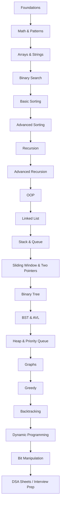

# 🚀 DSA Mastery Roadmap (TypeScript – FAANG Preparation)


This repository is my **TypeScript DSA journey**, preparing for FAANG-level coding interviews. It contains optimized solutions, notes, and patterns.

---

## 🎯 Objectives

- Master **TypeScript DSA + built-in methods**
- Solve **450–600 high-quality problems**
- Complete top DSA sheets: Striver, Love Babbar, Apna College
- Build intuition in:

  - Arrays, Strings, Binary Search
  - Recursion, Advanced Recursion
  - Trees, BST, AVL
  - Graphs, Heaps, Sliding Window, Two Pointers
  - Dynamic Programming, Backtracking, Greedy, Bit Manipulation

---

## 📂 Folder Structure

```
📦 learn-data-structure-and-algorithm-in-typescript
├── 00_basics/
├── 01_time_space_complexity/
├── 02_pattern_problem/
├── 03_basics_of_math/
├── 04_basic_recursion/
├── 05_basic_sortings/
├── 06_advanced_sortings/
├── 07_arrays/
├── 08_binary-search/
├── 09_strings/
├── 10_advanced_recursion/
├── 11_oops/
├── 12_linked_list/
├── 13_stack/
├── 14_queue/
├── 15_binary_tree/
├── 16_binary_search_tree/
├── 17_avl_tree/
├── 18_heap/
├── 19_sliding_window/
├── 20_graph/
├── 21_greedy/
├── 22_backtracking/
├── 23_dynamic_programming/
├── 24_bit_manipulation/
├── DSA-Sheet/
├── LICENSE
└── README.md
```

---

## 📈 Progress Tracker

> ✅ Click a topic to open its folder.
> 🟢 Completed, 🟡 In Progress, ⚪ Pending

| Topic                                                 | Status | Questions Completed |
| ----------------------------------------------------- | ------ | ------------------- |
| [00_basics](./00_basics)                              | 🟢     |                     |
| [01_pattern_problem](./01_pattern_problem)            | 🟡     | 4/20                |
| [02_time_space_complexity](./02_time_space_complxity) | ⚪     | 0/0                 |
| [03_basics_of_math](./03_basics_of_math)              | ⚪     | 0/0                 |
| [04_basic_recursion](./04_basic_recursion)            | ⚪     | 0/0                 |
| [05_basic_sorting](./05_basic_sortings)               | ⚪     | 0/0                 |
| [06_advanced_sorting](./06_advanced_sorting)          | ⚪     | 0/0                 |
| [07_arrays](./07_arrays)                              | ⚪     | 0/0                 |
| [08_binary-search](./08_binary-search)                | ⚪     | 0/0                 |
| [09_strings](./09_strings)                            | ⚪     | 0/0                 |
| [10_advanced_recursion](./10_advanced_recursion)      | ⚪     | 0/0                 |
| [11_oops](./11_oops)                                  | ⚪     | 0/0                 |
| [12_linked_list](./12_linked_list)                    | ⚪     | 0/0                 |
| [13_stack](./13_stack)                                | ⚪     | 0/0                 |
| [14_queue](./14_queue)                                | ⚪     | 0/0                 |
| [15_binary_tree](./15_binary_tree)                    | ⚪     | 0/0                 |
| [16_binary_search_tree](./16_binary_search_tree)      | ⚪     | 0/0                 |
| [17_avl_tree](./17_avl_tree)                          | ⚪     | 0/0                 |
| [18_heap](./18_heap)                                  | ⚪     | 0/0                 |
| [19_sliding_window](./19_sliding_window)              | ⚪     | 0/0                 |
| [20_graph](./20_graph)                                | ⚪     | 0/0                 |
| [21_greedy](./21_greedy)                              | ⚪     | 0/0                 |
| [22_backtracking](./22_backtracking)                  | ⚪     | 0/0                 |
| [23_dynamic_programming](./23_dynamic_programming)    | ⚪     | 0/0                 |
| [24_bit_manipulation](./24_bit_manipulation)          | ⚪     | 0/0                 |

> Update the **status badge and QC number** as you solve problems.

---

## 🗺 Mermaid-style DSA Roadmap



---

## 🔥 Final Goal

- Master **core + advanced DSA in TypeScript**
- Build strong **problem-solving intuition**
- Solve **450–600 high-quality problems**
- Prepare for **FAANG Online Assessments**
- Build confidence for **Low-Level & High-Level Design**

---

## ⭐ Support

If you like this structure or want to start your DSA journey:

⭐ Star this repo
🍴 Fork it
📝 Use this folder template

---
